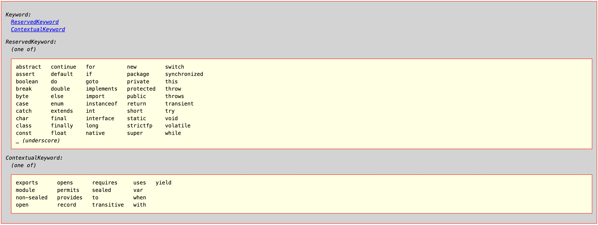

## First Program

```
    public class HelloWorld {
        public static void main (String[] args) {
            System.out.println("Hello World");
        }
    }
```

## Java Keywords

Following is list of all keywords in java



## Print first number

```
public class FirstNumber {

<!-- We will why below function needs to be static in future -->
    private static int getNumber(int num) {
        return num;
    }

    public static void main(String[] args) {
        int num = getNumber(4);
        num = num + num;
        System.out.println(num);
    }
}
```

## Starting out with Expressions

Write a program in java which gives factorial of given number

```
public class Factorial {

    private static long getFactorial(long number) {
        long factorial = 1;
        for (long i = number; i > 0; i--) {
            factorial = factorial * i;
        }
        return factorial;
    }

    public static void main(String[] args) {
        long factorial = getFactorial(4);

        System.out.println("factorial: " + factorial);
    }
}
```

## 8 Primitive data types in java


**Print smallest and largest integer in java**

```
public class Main {
    public static void main(String[] args) {
        int smallestInt = Integer.MIN_VALUE;
        int largestInt = Integer.MAX_VALUE;

        System.out.println(smallestInt + " " + largestInt);
        <!-- Output is: "-2147483648 2147483647" -->
    }
}
```

#### byte, short, int, long are other whole number data types in increasing order of range

`long largeNum = 40000000` will be considered int type by default so using prefix `long largeNum = 40000000L` is recommended.
