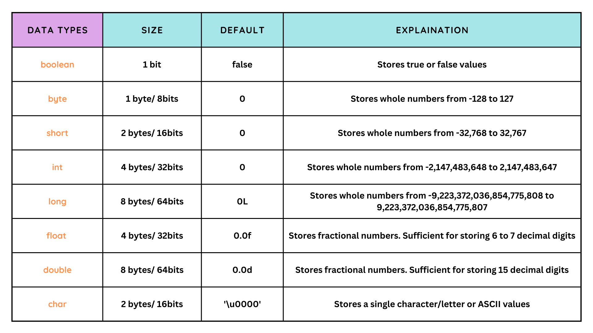

# First Program

```
    public class HelloWorld {
        public static void main (String[] args) {
            System.out.println("Hello World");
        }
    }
```

# Java Keywords

Following is list of all keywords in java


# Print first number

```
public class FirstNumber {

<!-- We will why below function needs to be static in future -->
    private static int getNumber(int num) {
        return num;
    }

    public static void main(String[] args) {
        int num = getNumber(4);
        num = num + num;
        System.out.println(num);
    }
}
```

# Starting out with Expressions

Write a program in java which gives factorial of given number

```
public class Factorial {

    private static long getFactorial(long number) {
        long factorial = 1;
        for (long i = number; i > 0; i--) {
            factorial = factorial * i;
        }
        return factorial;
    }

    public static void main(String[] args) {
        long factorial = getFactorial(4);

        System.out.println("factorial: " + factorial);
    }
}
```

# 8 Primitive data types in java



**Print smallest and largest integer in java**

```
public class Main {
    public static void main(String[] args) {
        int smallestInt = Integer.MIN_VALUE;
        int largestInt = Integer.MAX_VALUE;

        System.out.println(smallestInt + " " + largestInt);
        <!-- Output is: "-2147483648 2147483647" -->
    }
}
```

#### byte, short, int, long are other whole number data types in increasing order of range

`long largeNum = 40000000` will be considered int type by default so using prefix `long largeNum = 40000000L` is recommended.

# Type Casting in java

Mostly always use int

Supposedly, we have an integer
`int num = 4;`

and another byte
`byte halfNum = num/2;`

Above code will throw error as halfNum can have value which will not be in range of byte.
But if we know it will have value in range of byte, we can type cast the expression like below

`byte halfNum = (byte) (num/2);`

# `float` and `double` data types in java

`double` is java's default type for any decimal or real number

In Java, the range of a float is \(1.4\times 10^{-45}\) to \(3.4\times 10^{38}\), while the range of a double is \(4.9\times 10^{-324}\) to \(1.7976931348623157\times 10^{308}\).

Casting can be applied on float and double data types as well

# `char` and `boolean` data types

`char myChar = 'a';`
**char** is always defined in single quotes whereas **String** is defined in double quotes
We can assign a value to char in 3 formats:

1. Simple char assignment
   `char myChar = 'd'`
2. Unicode char assignment: (Apply `"\"` prefix before unicode)
   `char myChar = '\u0044'`
3. Decimal char assignment
   `char myChar = 68`

(All above variables have character **"d"** stored in them)

# `boolean` Data type

boolean data types have only 2 values stored in them **true** and **false**

```
    boolean truthyBooleanValue = true;
    boolean falsyBooleanValue = false;
```

### Note:

1. We will almost never have to use byte datatype
2. Mostly we only use **int**, **double** and **boolean** datatype
3. Sometimes in rare cases, we use **long** and **char** datatype

# String data type

1. String is not primitive data type in java, it's actually a class, that's why S is capital
2. Two strings can be concated with **+** sign
3. Strings are not mutable, every time a new string is created when change in existing string
4. String data type immutable, to overcome this we have inbuilt class in Java: **StringBuilder** which is mutable.
5. We will see about String and StringBuilder in future in detail
6. We can treat String data type as 9th primitive type, although it is not primitive data type but a class
7. Java language makes it easy to assign value to String class and concat using "+". This is not frequent behavior for other classes in java.

```
String firstString = "Hello";
String secondString = "World";

String finalString = firstString + " " + secondString;
```
