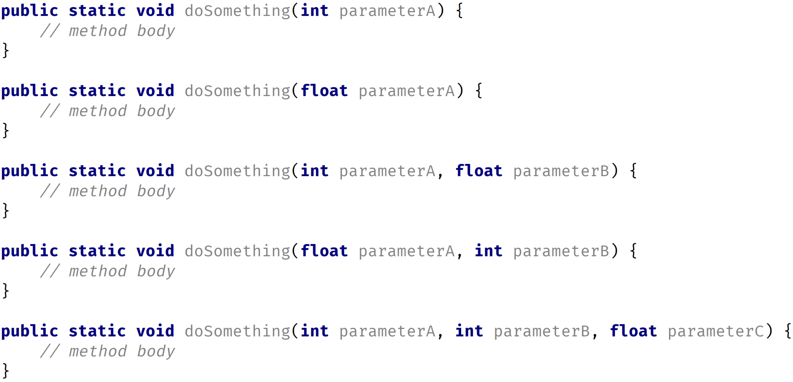
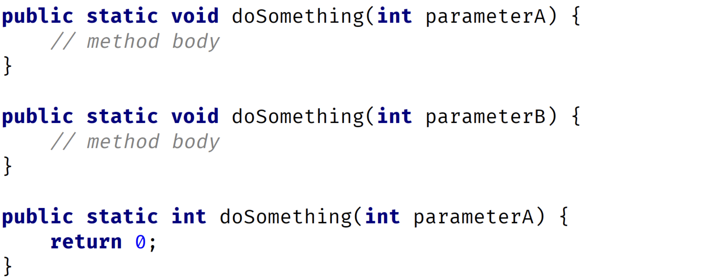

# Keywords and Expressions

1. We can't create variable names with keywords in java

# Methods in Java:

1. Methods need to be defined inside a class
2. When we pass parameters to a method, java internally creates a variable of that parameter in function
3. So we can't create another variable of same name as parameter in java
4. We can't have named method inside another method. (Unlike javascript)

(In JS, we can define function inside another function)

### Default values for parameters

1. In many languages, methods can be defined with default values, and you can omit passing values for these when calling the method.
2. But Java doesn't support default values for parameters.
3. There are work-arounds for this limitation, and we'll be reviewing those at a later date.
4. But it's important to state again, in Java, the number of arguments you pass, and their type, must match the parameters in the method declaration exactly.

# Method overloading

1. Method overloading occurs when a class has multiple methods with the same name, but the methods are declared with different parameters.
2. So, you can execute multiple methods with the same name, but call it with different arguments.
3. Java can resolve which method it needs to execute based on the arguments being passed when the method is invoked.

### In following example, method overloading is applied on doSomething() method

### Following are examples of invalid overloaded methods

1. Parameter names are not important when determining if a method is overloaded.
2. Nor are return types used when determining if a method is unique.
   
