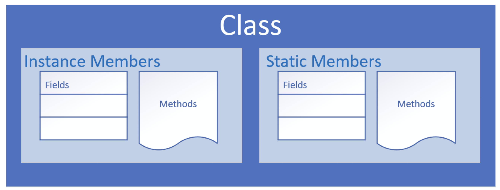

# Object Oriented Programming

Object-Oriented Programming is a way to model real-world objects as software objects which contain both data and code.

### Class based Programming

1. Modelling real-world objects as software objects is a fundamental part of Object-Oriented Programming.
2. A software object stores its state in fields, which can also be called variables or attributes.
3. Objects expose their behavior with methods which I've talked about before.
4. So, where does a class fit in?
5. Well, think of a class as a template or a blueprint for creating objects.

### The Class as blueprint

1. The class describes the data (fields), and the behavior (methods), that are relevant to the real-world object we want to describe.
2. These are called class members.
   
3. A class member can be a field or a method, or some other type of dependent element.
4. If a field is static, there is only one copy in memory, and this value is associated with the class or template itself.
5. If a field is not static, it's called an instance field, and each object may have a different value stored for this field.
6. A static method can't be dependent on any one object's state, so it can't reference any instance members.
7. In other words, any method that operates on instance fields needs to be non-static.

# Organizing classes

1. Classes can be organized into logical groupings which are called packages.
2. You declare a package name in the class using the package statement.
3. If you don't declare a package, the class implicitly belongs to the default package.

### Access modifiers for class members

1. An access modifier at the member level allows granular control over class members.
2. The valid access modifiers are shown in this table from the least restrictive to the most restrictive.

| Access Keyword | Description                                                                                                                                         |
| -------------- | --------------------------------------------------------------------------------------------------------------------------------------------------- |
| public         | public means any other class in any package can access this class.                                                                                  |
| protected      | protected allows classes in the same package, and any subclasses in other packages, to have access to the member.                                   |
|                | When the modifier is omitted, this has special meaning, called package access, meaning the member is accessible only to classes in the same package |
| private        | private means that no other class can access this member                                                                                            |
