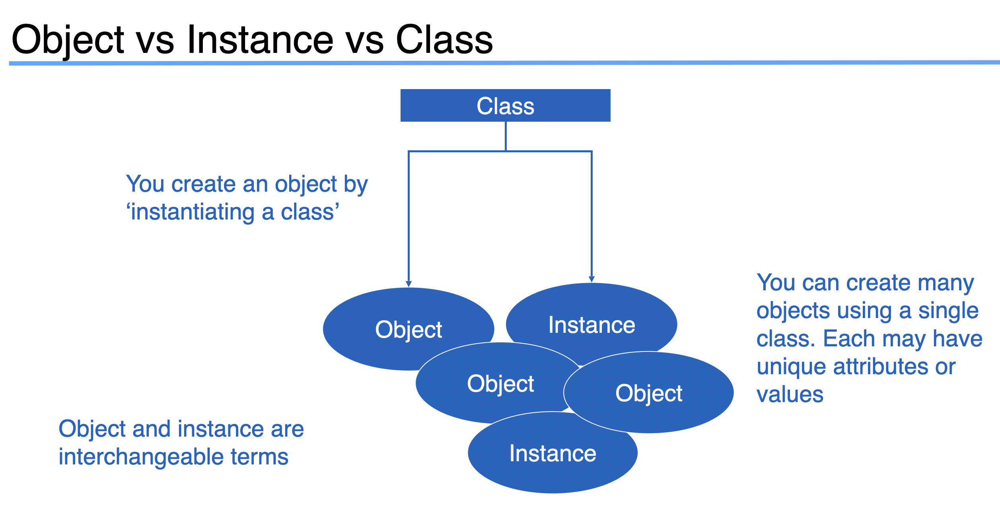
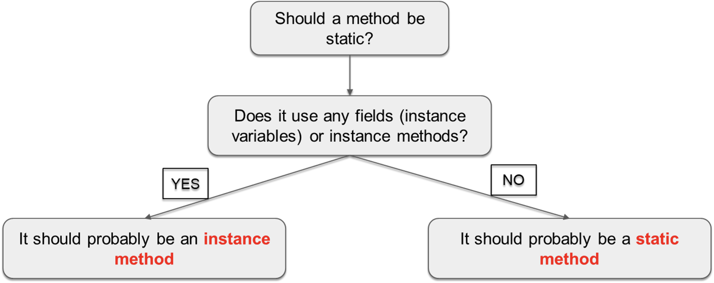

# Object Oriented Programming

Object-Oriented Programming is a way to model real-world objects as software objects which contain both data and code.

### Class based Programming

1. Modelling real-world objects as software objects is a fundamental part of Object-Oriented Programming.
2. A software object stores its state in fields, which can also be called variables or attributes.
3. Objects expose their behavior with methods which I've talked about before.
4. So, where does a class fit in?
5. Well, think of a class as a template or a blueprint for creating objects.

### The Class as blueprint

1. The class describes the data (fields), and the behavior (methods), that are relevant to the real-world object we want to describe.
2. These are called class members.
   
3. A class member can be a field or a method, or some other type of dependent element.
4. If a field is static, there is only one copy in memory, and this value is associated with the class or template itself.
5. If a field is not static, it's called an instance field, and each object may have a different value stored for this field.
6. A static method can't be dependent on any one object's state, so it can't reference any instance members.
7. In other words, any method that operates on instance fields needs to be non-static.

# Organizing classes

1. Classes can be organized into logical groupings which are called packages.
2. You declare a package name in the class using the package statement.
3. If you don't declare a package, the class implicitly belongs to the default package.

### Access modifiers for class members

1. An access modifier at the member level allows granular control over class members.
2. The valid access modifiers are shown in this table from the least restrictive to the most restrictive.

| Access Keyword | Description                                                                                                                                         |
| -------------- | --------------------------------------------------------------------------------------------------------------------------------------------------- |
| public         | public means any other class in any package can access this class.                                                                                  |
| protected      | protected allows classes in the same package, and any subclasses in other packages, to have access to the member.                                   |
|                | When the modifier is omitted, this has special meaning, called package access, meaning the member is accessible only to classes in the same package |
| private        | private means that no other class can access this member                                                                                            |

# Default values of data types

### What is null?

1. null is a special keyword in Java, meaning, the variable or attribute has a type but no reference to an object.
2. This means that no instance or object is assigned to the variable or field.
3. Fields with primitive data types are never null.
4. String can be null

Fields on classes are assigned default values automatically by Java, if you don't assign values yourself.
| Data type assigned | Default value assigned |
|--------------------|------------------------|
| boolean | false|
| byte, short, int, long, char | 0 |
| double, float | 0.0 |

# Constructor

1. A constructor is used in the creation of an object.
2. It is a special type of code block that has a specific name and parameters, much like a method.
3. It has the same name as the class itself, and it doesn't return any values.
4. You never include a return type from a constructor, not even void.
5. You can, and should, specify an appropriate access modifier to control who should be able to create new instances of the class, using this constructor.

```
public class Account {  // This is class declaration
    public Account() {  // This is constructor declaration
        // constructor code is code to be executed as the object is created
    }
}
```

### The default constructor

1. If a class contains no constructor declarations, then a default constructor is implicitly declared.
2. This constructor has no parameters and is often called the no-args (no arguments) constructor.
3. If a class contains any other constructor declarations, then a default constructor is NOT implicitly declared.

### Constructor overloading

1. Constructor overloading is declaring multiple constructors with different parameters.
2. The number of parameters can be different between constructors.
3. Or if the number of parameters is the same between two constructors, their types, or order of the types must differ.

### Constructor chaining

1. Constructor chaining is when one constructor explicitly calls another overloaded constructor.
2. You can only use constructor chaining, within constructors.
3. You must use the special statement this() to execute another constructor, passing it arguments if required.
4. And this() must be the first executable statement if it's used from another constructor.

```
public class Person {
    private String name;
    private int age;

    public Person() { // Empty constructor
        this("default_name", 21);
    }

    public Person(String name, int age) {
        this.name = name;
        this.age = age;
    }
}
```

(Check Customer class in code folder to see constructor overloading and constructor chaining)

# Reference vs Object vs Instance vs Class

1. Objects are reference type (Call by reference)
2. Primitive data types of value type (Call by value)
   

Lets say there is a class named Person.
Following line executes fine

```
public class Main {
    public static void main() {
        new Person();  // --> executes fine
    }
}
```

Bute because we have not assigned it any variable, there is no way to access any attribute or method of that object

# Static vs Instance Variables

It is considered best practice to use the Class name and not a reference variable to access a static variable.

```
public class Dog {
    private static String genus = "Canis";
    private String name = "Tommy";

    public void printAttributes () {
        System.out.println(Dog.genus);  // Best practice

        Dog d1 = new Dog();
        System.out.println(d1.name);   // Instance variables need to be called like this
    }
}
```

### Static variables

1. Declared by using the keyword static.
2. Static variables are also known as static member variables.
3. Every instance of the class shares the same static variable.
4. If changes are made to that variable, all other instances of that class will see the effect of that change.
5. Static variables aren't used very often but can sometimes be very useful.
6. They can be used for:
   a. Storing counters.
   b. Generating unique IDs.
   c. Storing a constant value that doesn't change, like PI, for example.
   d. Creating and controlling access to a shared resource.

### Instance variables

1. They don't use the static keyword.
2. They're also known as fields or member variables.
3. Instance variables belong to a specific instance of a class.
4. Each instance has its own copy of an instance variable.
5. Every instance can have a different value.
6. Instance variables represent the state of a specific instance of a class.

# Static vs Instance Methods

### Static methods

1. Static methods are declared using a static modifier.
2. Static methods can't access instance methods and instant variables directly.
3. They're usually used for operations that don't require any data from an instance of the class (from 'this').
4. If you remember, the **this** keyword is the current instance of a class.
5. Inside a static method, we can't use the **this** keyword.
6. Whenever you see a method that doesn't use instance variables, that method should probably be declared as a static method.
7. For example, main is a static method and it's called by the Java virtual machine when it starts the Java application.

### Instance methods

1. Instance methods belong to an instance of a class.
2. To use an instance method, we have to instantiate the class first, usually by using the new keyword.
3. Instance methods belong to an instance of a class.
4. To use an instance method, we have to instantiate the class first, usually by using the new keyword.
5. Instance methods can access instance methods and instance variables directly.
6. Instance methods can also access static methods and static variables directly.

### Static or Instance method


