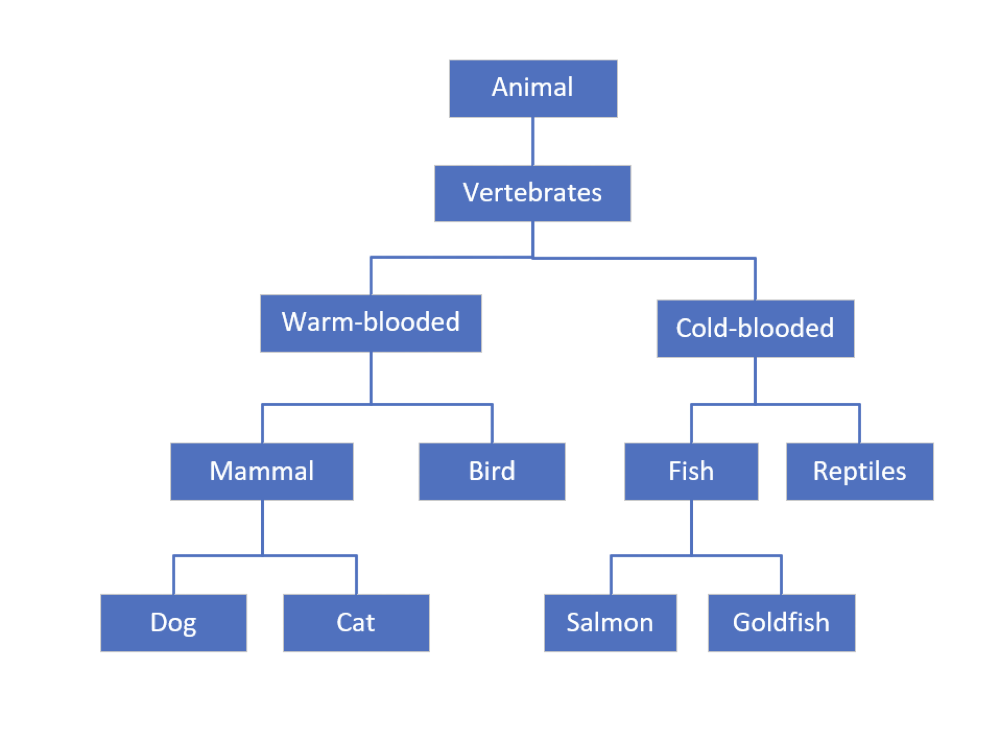
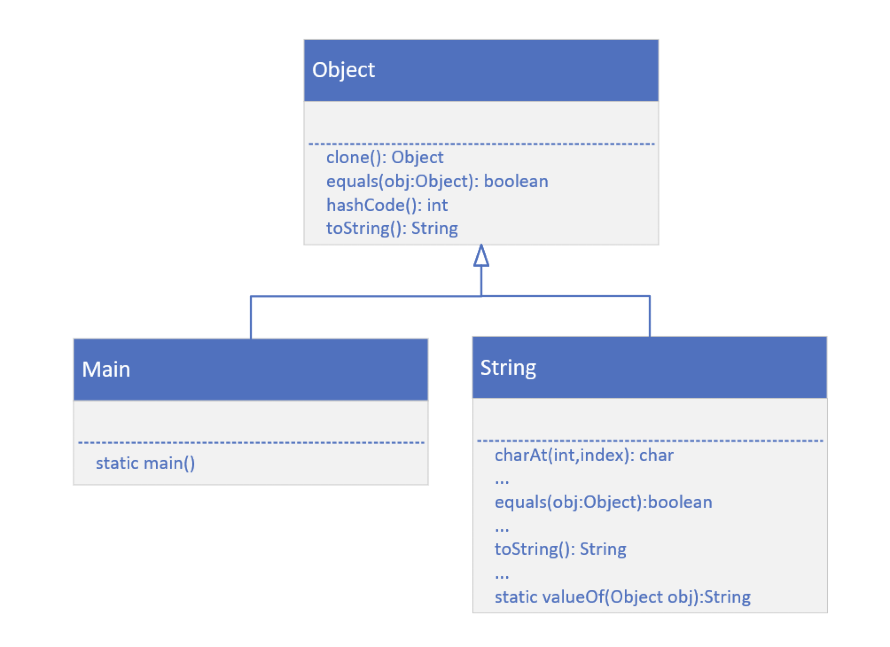
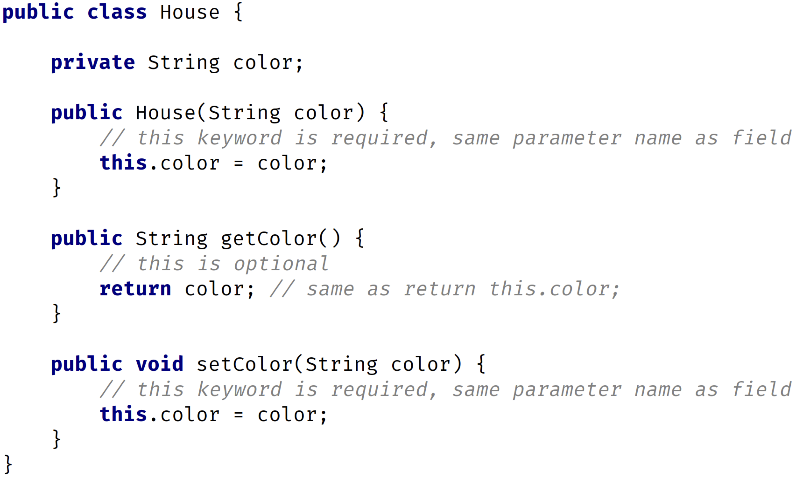
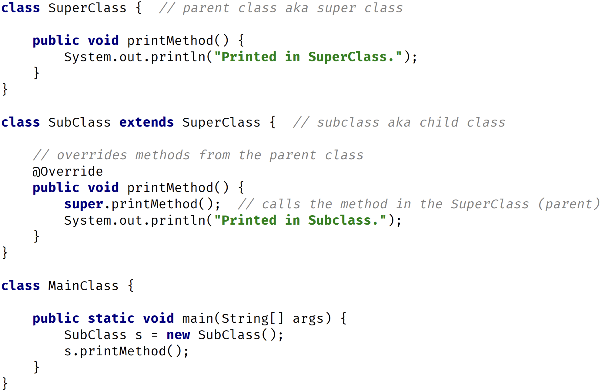
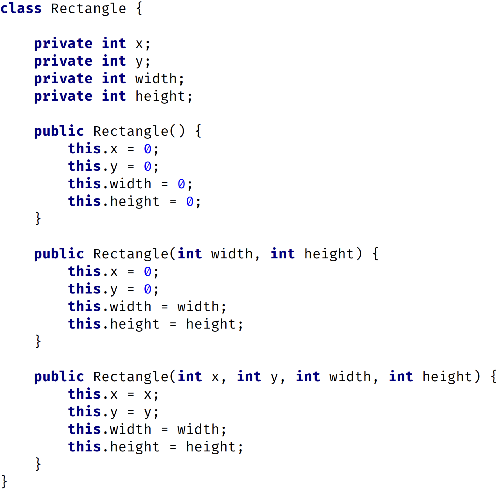
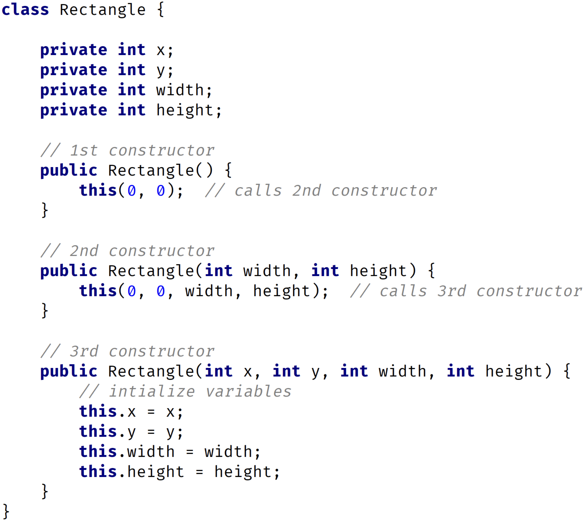
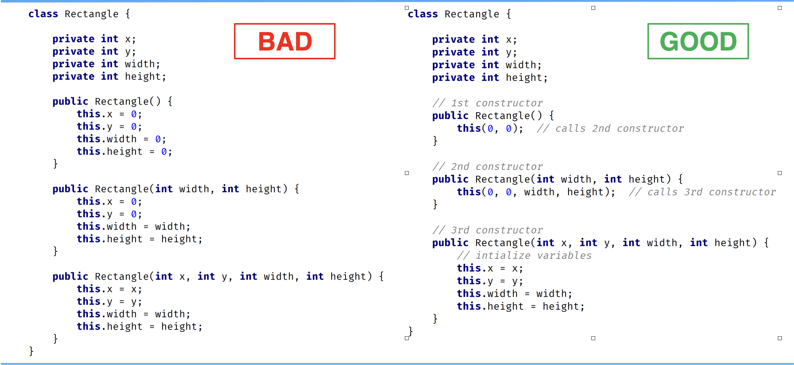
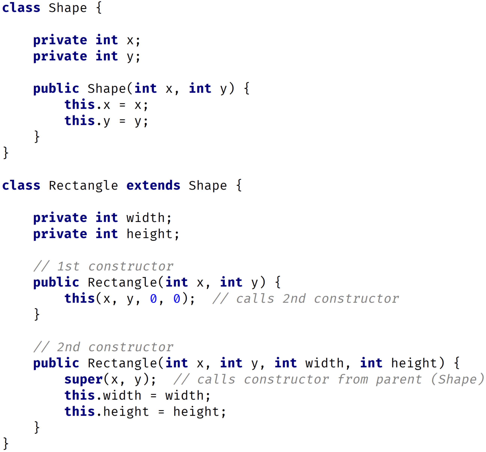

# Inheritance

1. What is Inheritance, and why is it so powerful?
2. We can look at Inheritance as a form of code reuse.
3. It's a way to organize classes into a parent-child hierarchy, which lets the child inherit (reuse), fields and methods from its parent.

1. Each box on this diagram represents a Class.
2. The most generic, or base class, starts at the top of the hierarchy.
3. Every class below it is a subclass.
4. So Animal is the base class. All the other classes can be said to be subclasses of Animal.
5. A parent can have multiple children, as we see with Mammal, which is the parent of Dog and Cat.
6. A child can only have one direct parent in Java.
7. But it will inherit from its parent class's parent and so on.

# Overriding a method

1. Overriding a method is when you create a method on a subclass, which has the same signature as a method on a super class.
2. You override a parent class method when you want the child class to show different behavior for that method.

### Overridden method

The overridden method can do one of three things:

1. It can implement completely different behavior, overriding the behavior of the parent.
2. It can simply call the parent class's method, which is somewhat redundant to do.
3. Or the method can call the parent class's method and include other code to run so it can extend the functionality for the Dog, for that behavior.

# java.lang.object

1. Every class you create in Java actually extends a special Java class.
2. That class is named Object, and it's in the java.lang package.
   
   a. This image shows that my Main class inherits from, or is a subclass of Object, as is also the case with String.
   b. The String class has over 60 methods!
   c. The String class overrides several methods on Object, two of which are equals() and toString().
3. Object class documentation: [Object class](https://docs.oracle.com/en/java/javase/17/docs/api/java.base/java/lang/Object.html)

# this vs super

1. The keyword super is used to access or call the parent class members (both variables and methods).
2. The keyword this is used to call the current class members (both variables and methods).
3. this is required when we have a parameter with the same name as an instance variable or field.

**NOTE: We can use either of these two keywords anywhere in a class except for static elements such as a static method. Any attempt to do so will lead to compile time errors.**

### keyword **this**

1. The keyword this is commonly used within constructors and setters and is optionally used within getters.
   In above example, I'm using the this keyword in a constructor and setter since there's a parameter with the same name as the instance or field.
   In the getter, I don't have any parameters so there's no conflict. Therefore, the use of this is optional there.

### keyword **super**

1. The keyword super is commonly used with method overriding when we call a method with the same name from the parent class.
2. In this example, I have a method called printMethod that calls super.printMethod.

### this() vs super() call

1. In Java, we've got the this() and super() calls. Notice the parentheses.
2. These are known as calls since they look like regular method calls although we're calling certain constructors.
3. Use this() to call a constructor from another overloaded constructor in the same class.
4. The call to this() can only be used in a constructor, and it must be the first statement in a constructor.
5. It's used with constructor chaining, in other words, when one constructor calls another constructor, and it helps to reduce duplicated code.
6. The only way to call a parent constructor is by calling super(), which calls the parent constructor.
7. The Java compiler puts a default call to super() if we don't add it, and it's always a call to the no argument constructor, which is inserted by the compiler.
8. The call to super() must be the first statement in each constructor.
9. A constructor can have a call to super() or this(), but never both.

### Constructor bad example

1. Here, I have three constructors.
2. All three constructors initialize variables.
3. There's repeated code in each constructor.
4. I'm initializing variables in each constructor with some default values.
5. You should never write constructors like this.
6. Let's look at the right way to do this by using a this() call.

### Constructors Good Example

1. In this example, I still have three constructors.
2. The 1st constructor calls the 2nd constructor, the 2nd constructor calls the 3rd constructor, and the 3rd constructor initializes the instance variables.
3. The 3rd constructor does all the work.
4. No matter what constructor I call, the variables will always be initialized in the 3rd constructor.
5. This is known as constructor chaining, the last constructor has the responsibility to initialize the variables.

### Comparing Both Examples

### super() call example

# Method Overriding vs Overloading

### Method Overloading

1. Method overloading means providing two or more separate methods in a class with the same name but different parameters.
2. Method return type may or may not be different, and that allows us to reuse the same method name.
3. Overloading is very handy, it reduces duplicated code, and we don't have to remember multiple method names.
4. We can overload static or instance methods.
5. To the code calling an overloaded method, it looks like a single method can be called with different sets of arguments.
6. In actuality, each call that's made with a different set of arguments is calling a separate method.
7. Java developers often refer to method overloading, as compile-time polymorphism.
8. This means the compiler is determining the right method to call, based on the method name and argument list.
9. Usually overloading happens within a single class.
10. But methods can also be overloaded by subclasses.
11. That's because a subclass inherits one version of the method from the parent class, and then the subclass can have another overloaded version of that method.

### Method Overloading Rules

1. Methods will be considered overloaded if both methods follow the following rules:
   a. Methods must have the same method name.
   b. Methods must have different parameters.
2. If methods follow the rules above:
   a. They may or may not have different return types.
   b. They may or may not have different access modifiers.
   c. They may or may not throw different checked or unchecked exceptions.

### Method Overriding

1. Method overriding, means defining a method in a child class that already exists in the parent class, with the same signature (the same name, same parameters).
2. By extending the parent class, the child class gets all the methods defined in the parent class. Those methods are also known as derived methods.
3. Method overriding is also known as Runtime Polymorphism or Dynamic Method Dispatch because the method that is going to be called is decided at runtime by the Java virtual machine.
4. When we override a method, it's recommended to put @Override immediately above the method definition.
5. The @Override statement is not required, but it's a way to get the compiler to flag an error if you don't actually properly override this method.
6. We'll get an error if we don't follow the overriding rules correctly.
7. We can't override static methods, only instance methods can be overridden.

### Method Overriding Rules

A method will be considered overridden if we follow these rules.

1. It must have the same name and same arguments.
2. The return type can be a subclass of the return type in the parent class.
3. It can't have a lower access modifier. In other words, it can't have more restrictive access privileges.
4. For example, if the parent's method is protected, then using private in the child's overridden method is not allowed. However, using public for the child's method would be allowed, in this example.
5. Only inherited methods can be overridden, in other words, methods can be overridden only in child classes.
6. Constructors and private methods cannot be overridden.
7. Methods that are final cannot be overridden.
8. A subclass can use super.methodName() to call the superclass version of an overridden method.

### Overloading vs overloading

#### Overloading vs overloading differences

### Covariant Return Type

1. The return type of an overridden method can be the same type as the parent method's declaration.
2. But it can also be a subclass.
3. The term, covariant return type, is more appropriate.
4. I briefly mentioned in a previous video that there's a clone method on the class Object that all classes inherit from.
5. A simplified look at this declaration, for our purposes, is shown below.

And if you overrode this method by using IntelliJ's code generation tools, it would generate this code in your class:

6. But in general, when you're cloning an instance, you're going to want to return an Object that's the same type as the Object you are cloning.
7. Remember, I said all classes ultimately have Object as a base class, so every class can be said to be a covariant of Object.

